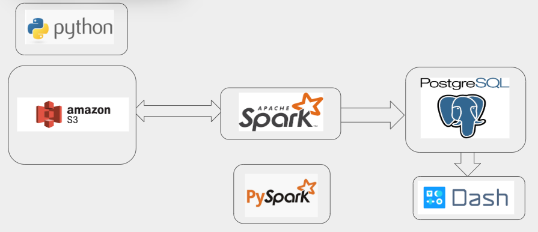

# Climate Watch #
## Introduction ##
Climate change is one of the main issues that human is facing. We need to crate an infrastructre in order to find effect of climate change on our planet. In this project, I created a pipeline that ingest daily claimate data from 1919 to 2018 and one kilometer elevation of the USA. Then it joins these two dataset to find how was effect of climate change in past one hundred years.  

## Data ##
[NOAA Global Historical Climatology Network Daily (GHCN-D)](https://registry.opendata.aws/noaa-ghcn/)  
[NOAA Global Elevation](https://registry.opendata.aws/meteo-france-models/)
[States Boundaries](https://datagateway.nrcs.usda.gov/)

## Technology stack:

## Slides and Demo 
[Slides](https://docs.google.com/presentation/d/1xakyw9JLUEgzHmZrjx9Aa-5eRgF4aWT2sDnC7AMejhw/edit?usp=sharing)
[Demo](https://www.youtube.com/watch?v=yTW_2DzChlM&feature=youtu.be)
[Link](http://data-engineering-project.xyz)

